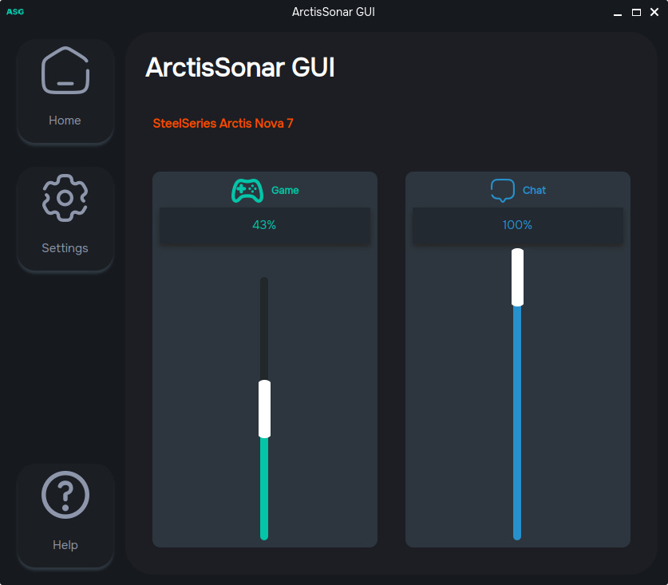
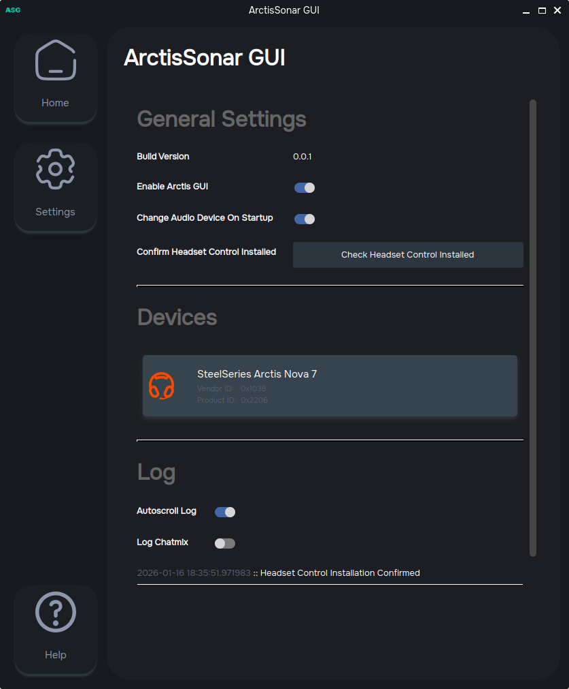

# About ArctisSonar GUI

ArctisSonar GUI is a small application made for Linux (PopOS to be exact) to emulate the best part of SteelSeries GG, the Sonar chatmix with a GUI. 



# The essay you would probably skip (I would too)

After making the semi-full (dual boot) switch to PopOS, I found that SteelSeries GG was not natively available to download on Linux. This was not ideal as I owned an Arctis 7X and had gotten so used to the chatmix feature that it started to bring up the "I miss Windows" feeling. 

However, not all hope was lost! After scouring the internet for about 5 minutes, I encountered [HeadsetControl](https://github.com/Sapd/HeadsetControl). It supported my headphones and also provided documentation to add other headphones with this feature. It was all there, except the game and chat audio sinks.

After scouring again, I found another app: [Linux-Arctis-7-Plus-ChatMix](https://github.com/awth13/Linux-Arctis-7-Plus-ChatMix). This application listened to the device, created the game and chat audio sinks, and changed the volumes appropriately. And the install script literally added the service to startup. It's all I could ask for.

But greed got me. Greed and the need to see a GUI got me bad.

I wanted an app that showed me it was working with a, lets be honest, **completely** unnecessary moving slider to represent the chatmix.

Then it devolved into **"Well I might as well make it look sorta like SteelSeries GG"**.

I finally hit the rock bottom of people pleasing with "What if it worked for others too?".

> Long story short, this is not needed. It is a first world problem that I created and solved. But it was definitely satisfying once I finished it (for about 2 days)

Anyone and everyone is welcome to fork the repository for their needs. As time goes on, I will be updating the documentation (and possibly the application itself).

# Installation

To install this, you will need to install the following:

1. [HeadsetControl](https://github.com/Sapd/HeadsetControl)

To setup headset control, you can use the following link: https://github.com/Sapd/HeadsetControl/wiki/Development-1-%E2%80%90-Adding-a-device

Afterwards, you can download the zip file in the releases folder. It contains the following:

1. An AppImage
2. An install script (copies the app image to the home folder along with the .desktop shortcut)

Extract this to a directory and run the install script.

```sh
cd ArctisSonarGUI
./installArctisSonar.sh
```

If successful, the application should show up in your Applications.


## Building the Application

To build the application, clone the repository and run the following command to install the python packages.

```sh
pip install -r requirements.txt
```

To confirm that the application runs, run the following command.

```sh
python ./main.py
```

To build an app image, run the following command.

```sh
pyinstaller ./main.spec
```


# Usage


The application should be fairly straightforward to use. The home screen shows the selected device and the chatmix volumes. Currently, the volume sliders are not interactable (I considered it but I didn't see much of a point).

Since the application uses headset control as an API, it should work with other chatmix supported headsets.



The `Enable Arctis GUI` toggle should remove the created virtual audio sinks and stop listening to headsetControl.

Devices that support chatmix are listed. The application should remember these settings. For debugging purposes, the vendor and product id are shown in the device button.

Logs are automatically stored in your Documents folder under `ArctisSonar GUI/AppLogFiles`. The user can also view the logs in the settings page and toggle to log the chatmix calculations.

Clicking the close button will minimize the application. A tray icon is created to reopen the application. Due to some problems with Wayland, I could not hide it as it would not show up afterwards. Hopefully this will be fixed eventually.


# Future Work

I plan to update the application every once in a while. As mentioned before, feel free to fork the project to make it better. My main goal would be to provide code documentation for this app.

There is some code in place to add themes.

# Disclaimer

The theme colours in `ui/assets/themes.py` were generated using some AI. I did not feel strongly enough about being 100% faithful to the original so I delegated the work.


# Acknowledgments

This project was heavily inspired from [Linux-Arctis-7-Plus-ChatMix](https://github.com/awth13/Linux-Arctis-7-Plus-ChatMix).

And it would not exist without the work done on [HeadsetControl](https://github.com/Sapd/HeadsetControl). 

And of course, SteelSeries GG (before all the bloatware).

GGs.